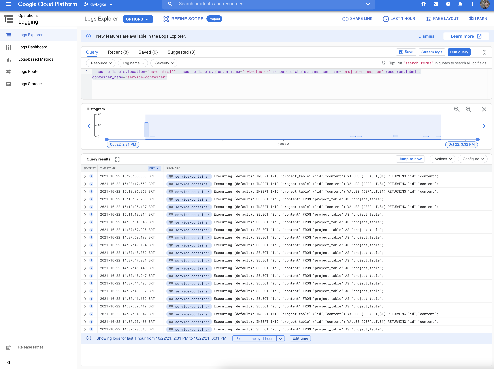

# Monitoring the project

Newly created GKE clusters have logging and metrics enabled by default. Navigate to https://console.cloud.google.com/logs?project=dwk-gke-328814.

This is the query used on the Logs Explorer:
```
resource.labels.location="us-central1" resource.labels.cluster_name="dwk-cluster" resource.labels.namespace_name="project-namespace" resource.labels.container_name="service-container"
```
The screenshot below illustrates the logs when a TODO was created.



