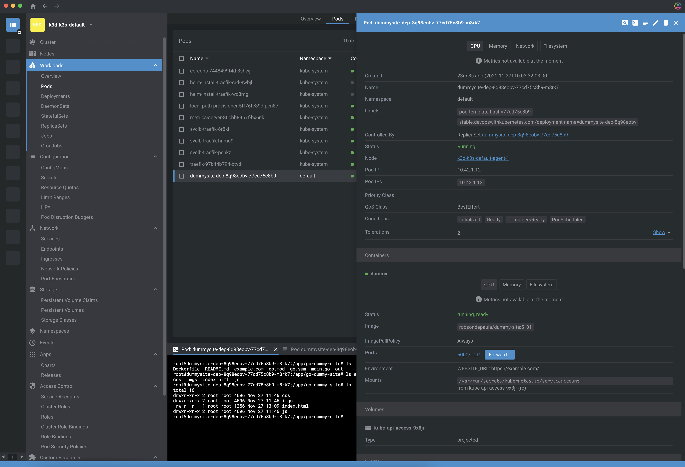

# DIY CRD & Controller

## Cluster setup
The tests are performed on a 'simple' cluster created like so:
```
k3d cluster create --agents 2
```

## Custom Resource Definition
The CRD was created using kubebuilder and the details can be found in the [controller](./controller) subfolder.

## DummySite
The deployment created by the CRD controller uses a Docker image created to clone the website. It contains a service written in the Go language that servers k8s health-check endpoints and also clones the website.  Details on how this image was obtained can be found in the [dummy-site](./dummy-site) subfolder.

# Validation
To validate the end-to-end requirement (deploy a CRD and check it clones a website), make sure you navigate to [controller](./controller) and follow the instructions there.

## Screenshots
The screenshot below shows the pod running the *dummy-site* image using [Lens](https://k8slens.dev/). The pod was created by the *controller* CRD.



Notice the https://example.com/ was downloaded successfully per the assignment instructions.