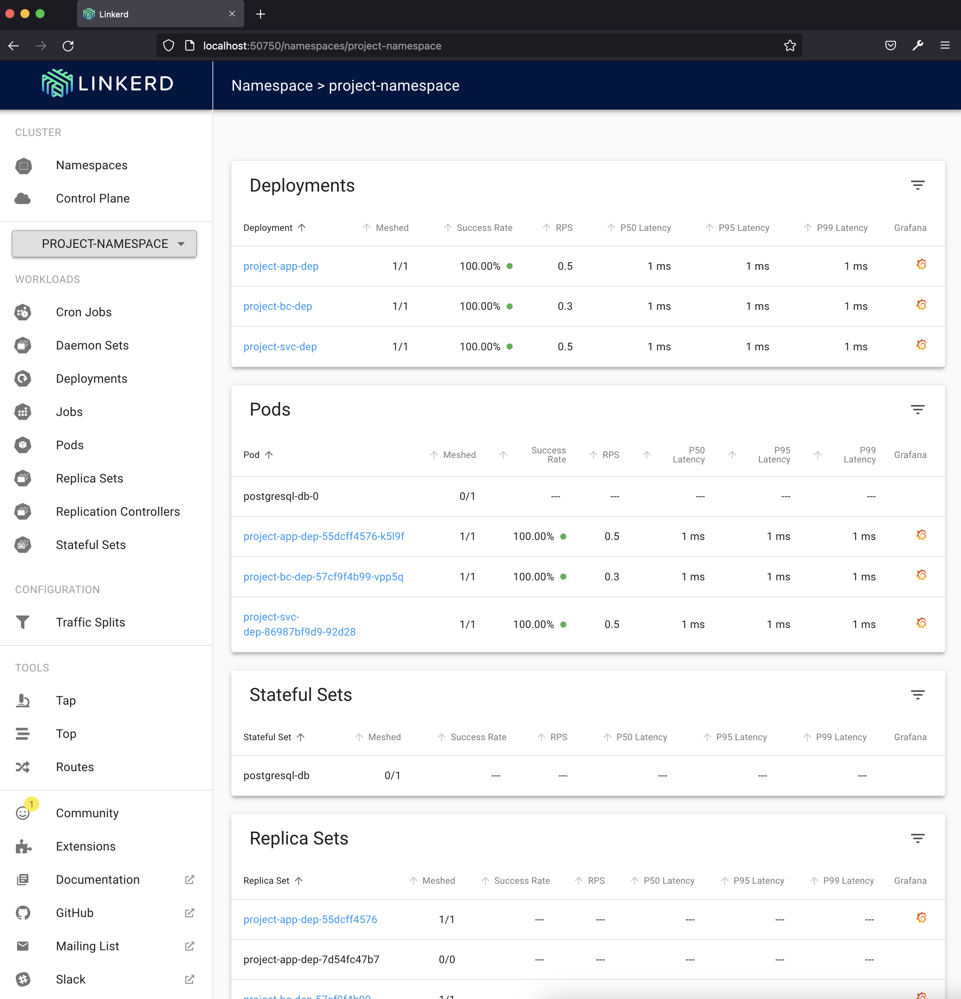

# Project: Service Mesh Edition

Check the result in [modified-project-manifests.yaml](./modified-project-manifests.yaml)

The viz dashboard illustrates the meshed project:



## Cluster setup
I used the convenience script [create_empty_cluster.sh](./create_empty_cluster.sh) to create an empty cluster.

## linkerd setup
Just followed the [linkerd](https://linkerd.io/2.11/getting-started/) docs up to step 5.1.

## Obtain modified project manifests using linkerd inject
1. Project dependencies:
```
helm install ingress-nginx ingress-nginx/ingress-nginx
helm install my-nats nats/nats
helm install sealed-secrets --namespace kube-system --version 1.16.1 sealed-secrets/sealed-secrets
```
2. Create the project namespace:
```
kubectl apply -f dependencies/namespace.yaml
```
3. Generate the sealed secret:
```
kubeseal --controller-namespace kube-system \
    --controller-name sealed-secrets \
    -o yaml <secret/secret.yaml> secret/sealedsecret.yaml
```
Apply it so that it becomes available for usage in the cluster:
```
kubectl apply -f secret/sealedsecret.yaml
```
Check it is available:
```
kubectl get secrets -n=project-namespace
```
4. Deploy the dependencies with kustomize:
```
kubectl apply -k dependencies/.
```
5. Make sure the dependencies are ready and only then deploy the project:
```
kubectl apply -k manifests/.
```
6. Obtain the 'mesh' manifests using linkerd inject:
```
kubectl get -n project-namespace deploy -o yaml \
    | linkerd inject - \
    > modified-project-manifests.yaml
```
7. And finally apply it:
```
kubectl apply -f modified-project-manifests.yaml
```


