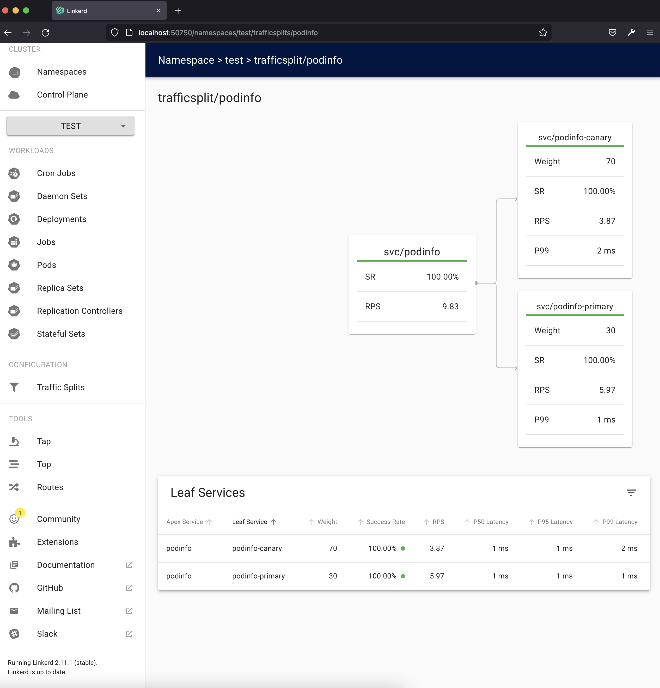

# Canary release in linkerd with Flagger

If not done, set up linkerd as described in [Service Mesh Edition](../5_02/README.md).

And then follow the [guide](https://linkerd.io/2.11/tasks/canary-release/).

The visual result of the canary release exercise is illustrated below:

Notice the traffic split occurring successfully with 70% traffic being handled by the canary while the primary is reduced to 30% traffic, progress occurs successfully until the end as guided by the documentation.