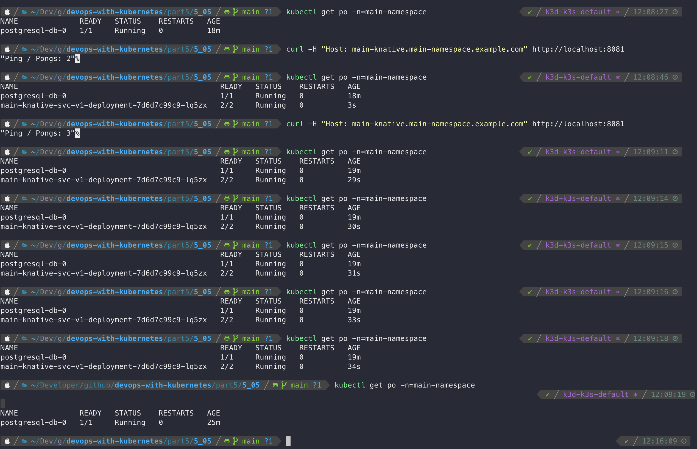

# Deploy to Serverless

Create the cluster as instructed on the assignment:
```
k3d cluster create --k3s-arg '--disable=traefik@server:0' --port 8082:30080@agent:0 -p 8081:80@loadbalancer --agents 2
```
Install Knative serving CRD:
```
kubectl apply -f https://github.com/knative/serving/releases/download/knative-v1.0.0/serving-crds.yaml
```
And Knative service core:
```
kubectl apply -f https://github.com/knative/serving/releases/download/knative-v1.0.0/serving-core.yaml
```
For ingress it was requested to use Contour, install it:
```
kubectl apply -f https://github.com/knative/net-contour/releases/download/knative-v1.0.0/contour.yaml
```
```
kubectl apply -f https://github.com/knative/net-contour/releases/download/knative-v1.0.0/net-contour.yaml
```

And configure Knative serving to use it:
```
kubectl patch configmap/config-network \
  --namespace knative-serving \
  --type merge \
  --patch '{"data":{"ingress.class":"contour.ingress.networking.knative.dev"}}'
```

## Serverless pingpong
1. Create the namespace
```
kubectl apply -f manifests/namespace.yaml
```
2. Install SealedSecret CRD, server-side controller into kube-system namespace
```
helm install sealed-secrets --namespace kube-system --version 1.16.1 sealed-secrets/sealed-secrets
```
3. Generate the sealed secret:
```
kubeseal --controller-namespace kube-system \
    --controller-name sealed-secrets \
    -o yaml <secret/secret.yaml> secret/sealedsecret.yaml
```
Apply it so that it becomes available for usage in the cluster:
```
kubectl apply -f secret/sealedsecret.yaml
```
Check it is available:
```
kubectl get secrets -n=main-namespace
```
4. Deploy the configuration maps:
```
kubectl apply -f manifests/config
```
5. Make sure the config maps are ready and only then deploy the database:
```
kubectl apply -f manifests/db
```
6. Make sure the DB is ready and only then deploy the serverless pingpong service:
```
kubectl apply -f manifests/svc
```

### Testing the serverless behavior
Check the service is available:
```
kubectl get ksvc -n=main-namespace
```
Check we have 0 "main-knative-svc-***" pods:
```
kubectl get po -n=main-namespace
```
Make the request to the service:
```
curl -H "Host: main-knative.main-namespace.example.com" http://localhost:8081
```
Check one pod was spawned:
```
kubectl get po -n=main-namespace
```
And that it will be scaled down to zero after some idle time.

